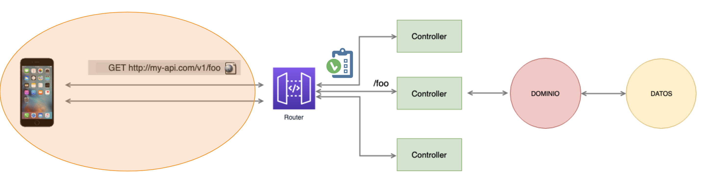

# Workshop API Node.js & Express

> ¿Por qué este workshop?

El objetivo del taller es aprender a crear un API Rest con Node.js y Express. Construiremos nuestros endpoints validados y testeados correctamente. Utilizaremos una base de datos MongoDB en la nube y conectaremos con servicios de terceros para obtener cierta información. Todo ello intentando aplicar buenas prácticas de desarrollo y testing.
Vamos a preparar la api para un “kairosTinder”

> Requisitos

Javascript nivel básico. Será necesario tener instaladas las siguientes herramientas antes del inicio del taller. Si tienes alguna duda puedes contactar directamente con cualquiera de los profesores que te ayudarán a tenerlo todo listo.

* Node.js 12.16 LTS https://nodejs.org/es/
* NPM https://www.npmjs.com/get*npm
* Postman https://www.postman.com/
* Robo 3T https://robomongo.org/download
* GIT
* Editor favorito (VS Code, Atom, Sublime…)

> ¿Quienes somos?

* Beatriz de Miguel (beatriz.demiguel@kairosds.com) Programadora front desde hace 6 años y desde hace 1 año más enfocada en el mundo backend.

* Víctor Pose (victor.pose@kairosds.com) Desarrollador con más de 5 años de experiencia en Back, tanto con Node.js como con Java.

> Antes de empezar

Conoce la estructura básica de un proyecto backend:

Elementos:

* Rutas: donde se conecta qué controladores o middlewares ejecutar para una petición HTTP.
* Controladores: donde se ubican las funciones o middlewares que sepan responder a las peticiones.
* Middlewares: donde se ubican las funciones que se encargarán de preprocesar o postprocesar los datos de las peticiones HTTP, por ejemplo, la autentificación de usuarios, validación de datos entre otros.
* Dominio: donde se define la lógica de negocio
* Datos: donde se definen los modelos que permitirán manipular la base de datos

¿Cómo es un proyecto con expressJS?

* [Ejemplo Hello world](http://expressjs.com/es/starter/hello-world.html)
* [Direccionamiento básico](http://expressjs.com/es/starter/basic-routing.html)

> Puesta en marcha

* [Robo3T](https://robomongo.org/)
* [Postman](https://www.postman.com/)
* [Debugging desde VSCode](https://code.visualstudio.com/docs/editor/debugging)

Ya puedes cambiar a la rama `challenge-0` y hacer el [challenge](challenge-0.md)

> Endpoint básico que conecta con Mongo

¿Qué es un ODM?

Es una librería de modelado, que nos permita manipular la base de datos sin necesidad de conocer mongodb a fondo. Hay tareas repetitivas que controlar como la inserción, la búsqueda, la conexión, evitar inyección de código malicioso, mapear los datos de la base a modelos, etc. Estas tareas y más son las que conforman normalmente un ORM (Object-Relational mapping).

* [Utiliza mongoose como ODM](https://mongoosejs.com/docs/index.html)
* [Define un modelo con mongoose](https://mongoosejs.com/docs/models.html)

Ya puedes cambiar a la rama `challenge-1` y hacer el [challenge](challenge-1.md)

> Patrón middleware y filtros con Mongo

* [Escritura de middleware para su uso en aplicaciones Express](http://expressjs.com/es/guide/writing-middleware.html)
* [Validaciones con JOI](https://hapi.dev/module/joi/#introduction)
* [Manejo de errores en Express](http://expressjs.com/es/guide/error-handling.html)
* [Utiliza códigos http](https://www.npmjs.com/package/http-status)

Ya puedes cambiar a la rama `challenge-2` y hacer el [challenge](challenge-2.md)

> Test de integración del Api con supertest

* [Mockear mongo con mongo memory server](https://www.npmjs.com/package/mongodb-memory-server)
* [HTTP assertions con supertest](https://github.com/visionmedia/supertest)

Ya puedes cambiar a la rama `challenge-3` y hacer el [challenge](challenge-3.md)

> Refactoring y estructura de proyecto

Ya puedes cambiar a la rama `challenge-4` y hacer el [challenge](challenge-4.md)

> Conexión con Apis externas.

* [HTTP mocks con nock](https://www.npmjs.com/package/nock)

Ya puedes cambiar a la rama `challenge-5` y hacer el [challenge](challenge-5.md)

> Documentación de api:

* [Documenta con openapi](https://swagger.io/docs/specification/about/)
* [Visualiza en swagger](https://swagger.io/tools/swagger-ui/)
