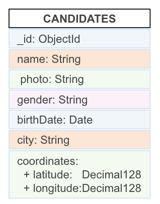

# Challenge: Endpoint para obtener listado de datos

- Lanza con postman el endpoint para obtener candidatos `GET http://localhost:3000/candidates` y su respuesta debe devolver los documentos de la colección de Candidates utilizando un modelo de mongoose.



Ejemplo respuesta:

```json
{
    "data": [
        {
            "_id": "5e8b47ace9ea099dbf055bff",
            "name": "Anna Morcillo",
            "photo": "https://randomuser.me/api/portraits/women/95.jpg",
            "birthDate": "21/07/1985",
            "gender": "F",
            "city": "Mataro",
            "coordinates": {
                "lat": 41.54,
                "long": 2.45
            }
        },
        {
            "_id": "5e8b47ace9ea099dbf055c00",
            "name": "Jesús Antón",
            "photo": "https://randomuser.me/api/portraits/men/83.jpg",
            "birthDate": "12/03/1997",
            "gender": "M",
            "city": "Salamanca",
            "coordinates": {
                "lat": 40.9704,
                "long": -5.67
            }
        },
        ...
    ]
}
```
